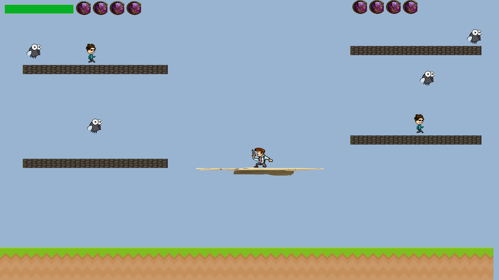
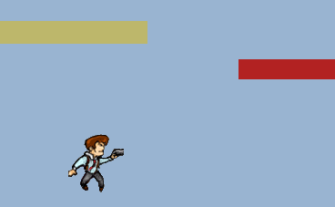
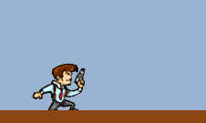
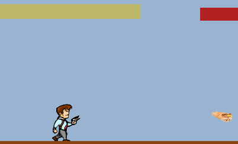
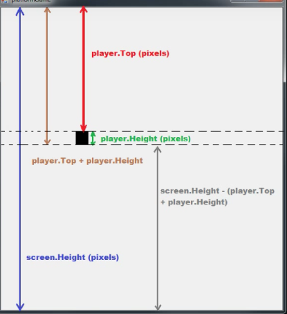
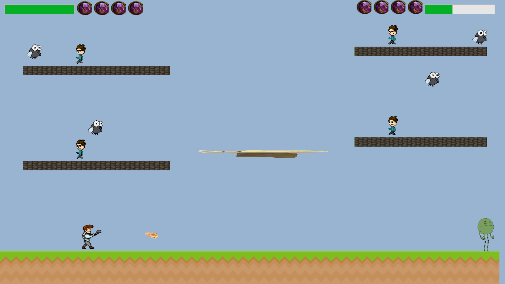

# 2dAdventure

Welcome to 2dAdventure, 2d game made in C#.

This is just an example of "one" of the game's levels.
I made all the necessary animations for the first player (the detective in left) and for the second player (the green monster in left). In this picture we see our "hero" shooting with bullets...shaorma-bullets.

Here's the animation for jumping. All the animations are both verified and inserted by the character's direction. This, for example, is the jumpleft animation; one of the many...

This is the leftcrouch's animation.

This is the animation for "rightwalking".
There are animations for both sides (left and right) for walking, standing, jumping, crouching, shooting, shooting while standing, shooting while walking and for dying.

These are some tips to look-up to for the collision and resolution.

I have to make the background, which I'll do once the game is finished.
I'm going to also add some background music, special effects and some funny special effects...thake it like some kind of "easter-egs".
The resolution is set for my laptop display (1366x768), but I made a method which puts everything in order for every other resolution (if_resolution_differs();). I set the limits of the borders, of the player and everything.
All the collisions are done. There's a collision for the blocks and a collision for the platform, which is moving up and down, allowing the hero to get on top of the other blocks. 
I have to shape the code a litlle bit to be cleaner.
In this 2d-world, 2dAdventure has 2 players, in CO-OP mode.

This is the second player getting his last "shaorma".

I still have to add some music and special effects, a menu and to clean the code...especially cleaning the code.
More updates soon.
